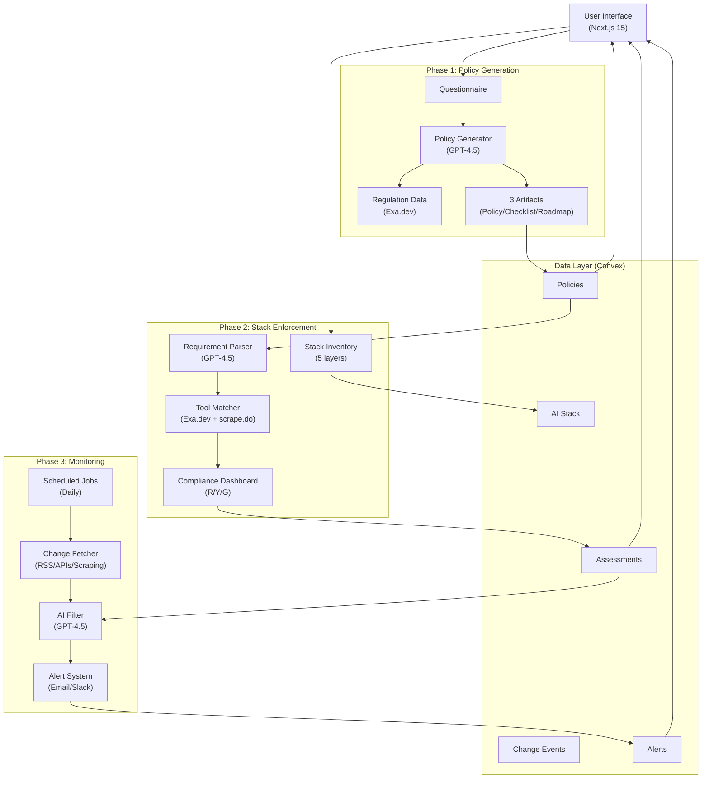
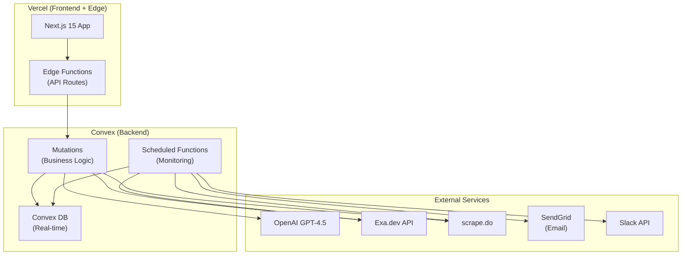

# AI Governance Lifecycle Platform — Architecture Document

**Version:** 2.0  
**Date:** 2026-02-01  
**Status:** Complete Design (Phase 1-3)  
**Owner:** Dhrub Biswas  
**Previous Version:** ARCHITECTURE.md (v1.0 - Phase 1 only)

---

## 1. System Overview

The **AI Governance Lifecycle Platform** is a three-phase system that automates the full governance lifecycle: **Generate** policies, **Enforce** them across AI infrastructure, and **Monitor** continuous compliance.

### Core Problems We Solve

**Phase 1: Policy Generation** (Week 1-2)
- **Input:** Enterprise context (sector, jurisdiction, risk profile)
- **Processing:** Fetch regulations + apply NIST AI RMF framework
- **Output:** Policy + Compliance Checklist + Implementation Roadmap
- **Time to value:** ~5 minutes (vs. 2-3 months manual)

**Phase 2: Stack Enforcement** (Month 2-3)
- **Input:** AI stack inventory (5 layers, tool details)
- **Processing:** Map tools → policy requirements → identify gaps
- **Output:** Compliance dashboard + Gap analysis + Remediation steps
- **Time to value:** ~30 seconds per tool assessment

**Phase 3: Continuous Monitoring** (Month 4-6)
- **Input:** Framework/vendor/org changes
- **Processing:** AI-powered filtering → Re-assessment → Alerts
- **Output:** Real-time alerts + Weekly summaries + Drift tracking
- **Time to value:** <24hr from change detected → user notified

---

## 2. High-Level Architecture (All Phases)



---

## 3. Phase 1: Policy Generation Engine

### 3.1 Components

#### **Questionnaire Module**

**Route:** `/generate`

**Input Schema:**
```typescript
interface QuestionnaireInput {
  // Core (required)
  sector: "finance" | "public_sector" | "healthcare" | "retail";
  jurisdiction: "au_federal" | "au_nsw" | "au_vic" | "au_qld";
  organization_size: "1-50" | "51-200" | "201-1000" | "1000+";
  risk_profile: "low" | "medium" | "high";
  
  // Context (optional)
  existing_ai_systems: boolean;
  regulations_in_scope: string[]; // e.g., ["Privacy Act", "ASIC"]
  team_maturity: "building" | "scaling" | "mature";
  compliance_focus: string[]; // e.g., ["risk_management", "transparency"]
}
```

**UI Flow:**
1. Step 1: Sector + Jurisdiction (dropdowns)
2. Step 2: Organization details (size, risk, maturity)
3. Step 3: AI context (existing systems, focus areas)
4. Submit → Streaming generation

---

#### **Policy Generator (AI Engine)**

**Technology:** OpenAI GPT-4.5 via Vercel AI SDK

**Prompt Strategy:**

**Artifact 1: AI Governance Policy (2-3 pages)**
```typescript
const policyPrompt = `
You are an expert in ${sector} AI governance and Australian regulatory compliance.

Generate a comprehensive AI Governance Policy tailored to:
- Sector: ${sector}
- Jurisdiction: ${jurisdiction}
- Organization size: ${org_size}
- Risk profile: ${risk_profile}

The policy must:
1. Address these regulations: ${regulations.map(r => r.name).join(', ')}
2. Map to NIST AI RMF controls
3. Be implementable by a team of size ${org_size}
4. Include specific requirements (not generic boilerplate)

Regulations (key requirements):
${regulations.map(r => `${r.name}: ${r.key_requirements}`).join('\n')}

Generate in Markdown with sections:
- Purpose & Scope
- AI System Classification
- Governance Structure
- Risk Assessment Framework
- Accountability Measures
- Transparency & Monitoring
- Training & Culture
- Compliance Requirements

Output as JSON: { "policy": "markdown_content" }
`;
```

**Artifact 2: Compliance Checklist**
```typescript
const checklistPrompt = `
Based on the policy above, generate a compliance checklist that maps:
1. EVERY requirement from these regulations: ${regulations.map(r => r.name)}
2. NIST AI RMF controls (Govern, Map, Measure, Manage)

Format as actionable items with:
- Requirement text
- Source regulation
- NIST control ID
- Responsible role
- Timeline estimate

Output as JSON: {
  "checklist": [
    {
      "item": "Conduct AI system risk assessment",
      "regulation": "ASIC AI Guidance",
      "nist_control": "GOVERN-2.1",
      "owner": "Chief Risk Officer",
      "timeline": "Month 1"
    }
  ]
}
`;
```

**Artifact 3: Implementation Roadmap (12-18 months)**
```typescript
const roadmapPrompt = `
Create a phased implementation roadmap:

Phases:
1. Foundation (Months 1-3): Governance structure, policies, baseline audit
2. Build (Months 4-9): Tools, training, process integration  
3. Scale (Months 10-18): Continuous monitoring, optimization

For org size ${org_size} and risk ${risk_profile}, specify:
- Objectives per phase
- Required resources (FTE, budget)
- Key milestones
- Risks & mitigations

Output as JSON: {
  "phases": [
    {
      "name": "Foundation",
      "duration": "Months 1-3",
      "objectives": [...],
      "resources": { "fte": 2, "budget": "$50K" },
      "milestones": [...],
      "risks": [...]
    }
  ]
}
`;
```

**Streaming Implementation:**
```typescript
import { streamText } from "ai";
import { openai } from "@ai-sdk/openai";

export async function generatePolicy(input: QuestionnaireInput) {
  // Fetch regulations from Exa.dev
  const regulations = await fetchRegulations(input.sector, input.jurisdiction);
  
  // Build prompts
  const prompts = [policyPrompt, checklistPrompt, roadmapPrompt];
  
  // Stream generation
  const results = await Promise.all(
    prompts.map(prompt => 
      streamText({
        model: openai("gpt-4.5"),
        system: prompt,
        temperature: 0.7,
        maxTokens: 3000,
      })
    )
  );
  
  return {
    policy: results[0],
    checklist: results[1],
    roadmap: results[2],
  };
}
```

---

#### **Regulation Data Source (Exa.dev)**

**Purpose:** Fetch up-to-date regulation text for policy generation

**Integration:**
```typescript
import { Exa } from "exa-js";

const exa = new Exa(process.env.EXA_API_KEY);

async function fetchRegulations(sector: string, jurisdiction: string) {
  const queries = buildRegulatoryQueries(sector, jurisdiction);
  
  const results = await Promise.all(
    queries.map(q => 
      exa.searchAndContents(q, {
        type: "keyword",
        numResults: 5,
        text: true,
      })
    )
  );
  
  return results.flatMap(r => r.results).map(doc => ({
    name: extractRegulationName(doc.title),
    key_requirements: extractRequirements(doc.text),
    source_url: doc.url,
  }));
}

function buildRegulatoryQueries(sector: string, jurisdiction: string): string[] {
  const base = {
    finance: ["Privacy Act 1988 Australia", "ASIC AI governance", "APRA risk management"],
    public_sector: ["Privacy Act 1988", "NSW AI ethics", "Australian AI ethics framework"],
    healthcare: ["Privacy Act 1988", "Therapeutic Goods Act", "AHPRA AI guidance"],
    retail: ["Privacy Act 1988", "Australian Consumer Law", "ACCC data practices"],
  };
  
  return base[sector] || base.finance;
}
```

---

#### **Data Model (Convex)**

**Collection: `policies`**
```typescript
export default defineSchema({
  policies: defineTable({
    organizationId: v.optional(v.string()), // Future: multi-tenant
    sector: v.string(),
    jurisdiction: v.string(),
    
    // Generated artifacts
    policyDocument: v.string(), // Markdown
    complianceChecklist: v.array(v.object({
      item: v.string(),
      regulation: v.string(),
      nist_control: v.string(),
      owner: v.string(),
      timeline: v.string(),
    })),
    implementationRoadmap: v.array(v.object({
      name: v.string(),
      duration: v.string(),
      objectives: v.array(v.string()),
      resources: v.object({ fte: v.number(), budget: v.string() }),
      milestones: v.array(v.string()),
      risks: v.array(v.string()),
    })),
    
    // Metadata
    generatedAt: v.number(),
    generationTimeMs: v.number(),
    tokensUsed: v.number(),
    regulationsUsed: v.array(v.string()),
  }),
});
```

---

### 3.2 API Endpoints (Phase 1)

**POST `/api/generate`**
- Input: QuestionnaireInput
- Output: Stream (policy chunks)
- Processing:
  1. Validate input
  2. Fetch regulations (Exa.dev)
  3. Stream GPT-4.5 generation
  4. Save to Convex
  5. Return policy ID

**GET `/api/policy/:id`**
- Input: Policy ID
- Output: Complete policy data (JSON)

**GET `/api/policy/:id/export`**
- Input: Policy ID, format (pdf|docx|md)
- Output: File download

---

## 4. Phase 2: Stack Enforcement Engine

### 4.1 AI Stack Model (5 Layers)

```typescript
enum AILayer {
  FOUNDATION_MODELS = 1,      // GPT-4, Claude, Llama
  MODEL_TRAINING = 2,         // SageMaker, Azure ML, Databricks
  AI_AGENTS = 3,              // LangChain, LlamaIndex, AutoGPT
  MULTI_AGENT = 4,            // CrewAI, AutoGen, orchestration
  AUTONOMOUS_AGENTS = 5,      // Self-directed, RPA+AI
}

interface Tool {
  id: string;
  organizationId: string;
  
  // Required fields
  layer: AILayer;
  name: string;           // "OpenAI GPT-4"
  vendor: string;         // "OpenAI"
  
  // Optional fields (power users)
  useCase?: string;       // "Customer support chatbot"
  riskLevel?: "critical" | "high" | "medium" | "low";
  dataSensitivity?: "pii" | "financial" | "health" | "public";
  deployment?: "cloud" | "on-prem" | "hybrid";
  departments?: string;   // "Marketing, Sales"
  
  // Auto-populated
  addedAt: number;
  lastAssessedAt?: number;
}
```

---

### 4.2 Components

#### **Stack Inventory UI**

**Route:** `/enforce`

**Features:**
1. **Inventory Table**
   - Columns: Layer, Tool Name, Vendor, Risk Level, Status (R/Y/G)
   - Sortable by layer, risk, compliance status
   - Filter by layer, status
   
2. **Add Tool Modal**
   - Required: Layer (dropdown 1-5), Tool Name, Vendor
   - Optional: Use Case, Risk Level, Data Sensitivity, Deployment
   - Save → Triggers assessment

3. **Bulk Import (CSV)**
   - Upload CSV: layer,name,vendor,use_case,risk_level
   - Validate format
   - Import all → Trigger batch assessment

**Example Table:**
```
Layer | Tool          | Vendor     | Risk   | Status
------|---------------|------------|--------|--------
1     | GPT-4         | OpenAI     | High   | 🔴 2 violations
2     | SageMaker     | AWS        | Medium | 🟡 1 warning
3     | LangChain     | LangChain  | Low    | 🟢 Compliant
```

---

#### **Requirement Parser**

**Purpose:** Extract compliance requirements from generated policy (Phase 1)

**Input:** Policy document (markdown)  
**Output:** Structured requirements

**Implementation:**
```typescript
async function parseRequirements(policyDocument: string): Promise<Requirement[]> {
  const prompt = `
Extract all compliance requirements from this AI governance policy.

For each requirement, identify:
1. Requirement text (specific, actionable)
2. Policy section reference (e.g., "§3.2")
3. Criticality (critical/high/medium/low)
4. Applicable AI layers (1-5)

Policy document:
${policyDocument}

Output as JSON array:
[
  {
    "text": "All foundation models must support data residency in AU",
    "section": "3.2",
    "criticality": "critical",
    "layers": [1]
  }
]
`;

  const result = await generateText({
    model: openai("gpt-4.5"),
    prompt,
    temperature: 0.3, // Low temp for accuracy
  });
  
  return JSON.parse(result.text);
}
```

**Example Output:**
```json
[
  {
    "id": "req-1",
    "text": "All foundation models must support data residency in AU",
    "section": "3.2",
    "criticality": "critical",
    "layers": [1]
  },
  {
    "id": "req-2",
    "text": "Training data must be documented and versioned",
    "section": "4.1",
    "criticality": "high",
    "layers": [2]
  },
  {
    "id": "req-3",
    "text": "High-risk AI systems require human-in-the-loop approval",
    "section": "5.3",
    "criticality": "critical",
    "layers": [3, 4, 5]
  }
]
```

---

#### **Tool Matcher (Compliance Assessment)**

**Purpose:** Check if each tool meets policy requirements

**Data Sources:**
1. **Exa.dev API** (primary)
   - Search vendor compliance pages
   - Semantic search: "Does OpenAI GPT-4 support AU data residency?"
   
2. **scrape.do** (fallback)
   - Scrape Terms of Service
   - Extract compliance sections from vendor docs
   
3. **Cached Vendor Data** (performance)
   - Store vendor compliance info in Convex
   - Refresh weekly

**Implementation:**
```typescript
async function assessTool(tool: Tool, requirements: Requirement[]): Promise<Assessment[]> {
  // Fetch vendor compliance data
  const vendorData = await fetchVendorCompliance(tool.vendor, tool.name);
  
  // Filter requirements applicable to this tool's layer
  const applicableReqs = requirements.filter(r => 
    r.layers.includes(tool.layer)
  );
  
  // Assess each requirement
  const assessments = await Promise.all(
    applicableReqs.map(req => checkCompliance(tool, req, vendorData))
  );
  
  return assessments;
}

async function checkCompliance(
  tool: Tool, 
  requirement: Requirement, 
  vendorData: VendorCompliance
): Promise<Assessment> {
  const prompt = `
Tool: ${tool.name} by ${tool.vendor}
Requirement: ${requirement.text}

Vendor compliance data:
${JSON.stringify(vendorData, null, 2)}

Does this tool meet the requirement?

Output as JSON:
{
  "status": "compliant" | "warning" | "violation",
  "reasoning": "Explain why (cite vendor docs)",
  "remediation": "Actionable next step to fix (if violation/warning)"
}
`;

  const result = await generateText({
    model: openai("gpt-4.5"),
    prompt,
    temperature: 0.2,
  });
  
  const assessment = JSON.parse(result.text);
  
  return {
    toolId: tool.id,
    requirementId: requirement.id,
    status: assessment.status,
    reasoning: assessment.reasoning,
    remediation: assessment.remediation,
    assessedAt: Date.now(),
  };
}
```

**Example Assessment:**
```json
{
  "toolId": "tool-123",
  "requirementId": "req-1",
  "status": "violation",
  "reasoning": "OpenAI GPT-4 only supports US and EU regions. According to OpenAI's data residency documentation (https://platform.openai.com/docs/data-residency), AU region is not available.",
  "remediation": "Switch to Azure OpenAI with AU region enabled, or use Claude (Anthropic offers AU data residency via AWS Bedrock Sydney region).",
  "assessedAt": 1738394400000
}
```

---

#### **Vendor Compliance Fetcher**

**Exa.dev Integration:**
```typescript
async function fetchVendorCompliance(vendor: string, tool: string): Promise<VendorCompliance> {
  const queries = [
    `${vendor} ${tool} data residency compliance`,
    `${vendor} ${tool} terms of service AI usage`,
    `${vendor} ${tool} security compliance documentation`,
  ];
  
  const results = await Promise.all(
    queries.map(q => 
      exa.searchAndContents(q, {
        type: "neural",
        numResults: 3,
        text: true,
      })
    )
  );
  
  const docs = results.flatMap(r => r.results);
  
  return {
    vendor,
    tool,
    dataResidency: extractDataResidency(docs),
    securityCertifications: extractCertifications(docs),
    termsOfService: extractToS(docs),
    lastUpdated: Date.now(),
    sources: docs.map(d => d.url),
  };
}
```

**scrape.do Fallback:**
```typescript
async function scrapeVendorDocs(url: string): Promise<string> {
  const response = await fetch('https://api.scrape.do', {
    method: 'POST',
    headers: {
      'Authorization': `Bearer ${process.env.SCRAPE_DO_API_KEY}`,
      'Content-Type': 'application/json',
    },
    body: JSON.stringify({
      url,
      render: false, // Static page scraping
      country: 'AU', // Use AU residential proxy
    }),
  });
  
  const data = await response.json();
  return data.content;
}
```

---

#### **Compliance Dashboard**

**Route:** `/enforce/dashboard`

**Overview Page:**
```tsx
<ComplianceDashboard>
  <ScoreCard>
    <OverallScore>73%</OverallScore>
    <Subtitle>22 tools assessed</Subtitle>
  </ScoreCard>
  
  <BreakdownByLayer>
    <LayerCard layer={1} score={80} tools={5} />
    <LayerCard layer={2} score={65} tools={7} />
    <LayerCard layer={3} score={70} tools={6} />
    <LayerCard layer={4} score={75} tools={3} />
    <LayerCard layer={5} score={60} tools={1} />
  </BreakdownByLayer>
  
  <CriticalGaps>
    <Alert type="critical" count={5}>
      5 critical violations require immediate action
    </Alert>
  </CriticalGaps>
  
  <DonutChart data={[
    { status: 'Compliant', count: 12, color: 'green' },
    { status: 'Warning', count: 5, color: 'yellow' },
    { status: 'Violation', count: 5, color: 'red' },
  ]} />
</ComplianceDashboard>
```

**Drill-Down View (Per Tool):**
```tsx
<ToolCard tool={tool}>
  <Header>
    <Name>{tool.name}</Name>
    <Vendor>{tool.vendor}</Vendor>
    <Layer>Layer {tool.layer}</Layer>
    <RiskBadge>{tool.riskLevel}</RiskBadge>
  </Header>
  
  <StatusSummary>
    <Badge color="red">🔴 2 violations</Badge>
    <Badge color="yellow">⚠️ 1 warning</Badge>
  </StatusSummary>
  
  <Violations>
    {assessments.filter(a => a.status === 'violation').map(a => (
      <ViolationItem key={a.id}>
        <Title>❌ {getRequirement(a.requirementId).text}</Title>
        <Section>Policy {getRequirement(a.requirementId).section}</Section>
        <Problem>{a.reasoning}</Problem>
        <Fix>
          <strong>Remediation:</strong> {a.remediation}
        </Fix>
      </ViolationItem>
    ))}
  </Violations>
  
  <Warnings>
    {/* Similar structure for warnings */}
  </Warnings>
</ToolCard>
```

---

#### **Gap Analysis Export**

**Formats:** PDF, CSV, JSON

**PDF Report Structure:**
```typescript
interface AuditReport {
  // Executive Summary
  summary: {
    overallScore: number;
    totalTools: number;
    violationCount: number;
    warningCount: number;
    compliantCount: number;
  };
  
  // Tool Inventory
  inventory: {
    layer: number;
    tool: string;
    vendor: string;
    status: "compliant" | "warning" | "violation";
  }[];
  
  // Violation Details
  violations: {
    tool: string;
    requirement: string;
    policySection: string;
    reasoning: string;
    remediation: string;
  }[];
  
  // Remediation Roadmap (prioritized)
  roadmap: {
    priority: "critical" | "high" | "medium";
    tool: string;
    action: string;
    estimatedEffort: string;
    deadline: string;
  }[];
}
```

**Export Implementation:**
```typescript
import { PDFDocument } from 'pdf-lib';

async function exportAuditReport(
  assessments: Assessment[], 
  format: 'pdf' | 'csv' | 'json'
): Promise<Blob> {
  const report = buildAuditReport(assessments);
  
  if (format === 'pdf') {
    return generatePDF(report);
  } else if (format === 'csv') {
    return generateCSV(report);
  } else {
    return new Blob([JSON.stringify(report, null, 2)], { type: 'application/json' });
  }
}
```

---

### 4.3 Data Model (Phase 2 Additions)

**Collection: `tools`**
```typescript
tools: defineTable({
  organizationId: v.string(),
  
  // Required
  layer: v.number(), // 1-5
  name: v.string(),
  vendor: v.string(),
  
  // Optional
  useCase: v.optional(v.string()),
  riskLevel: v.optional(v.union(
    v.literal("critical"),
    v.literal("high"),
    v.literal("medium"),
    v.literal("low")
  )),
  dataSensitivity: v.optional(v.union(
    v.literal("pii"),
    v.literal("financial"),
    v.literal("health"),
    v.literal("public")
  )),
  deployment: v.optional(v.union(
    v.literal("cloud"),
    v.literal("on-prem"),
    v.literal("hybrid")
  )),
  departments: v.optional(v.string()),
  
  addedAt: v.number(),
  lastAssessedAt: v.optional(v.number()),
}).index("by_organization", ["organizationId"]),

requirements: defineTable({
  policyId: v.id("policies"),
  text: v.string(),
  section: v.string(),
  criticality: v.union(
    v.literal("critical"),
    v.literal("high"),
    v.literal("medium"),
    v.literal("low")
  ),
  layers: v.array(v.number()), // Which AI layers this applies to
}).index("by_policy", ["policyId"]),

assessments: defineTable({
  toolId: v.id("tools"),
  requirementId: v.id("requirements"),
  status: v.union(
    v.literal("compliant"),
    v.literal("warning"),
    v.literal("violation")
  ),
  reasoning: v.string(),
  remediation: v.string(),
  assessedAt: v.number(),
}).index("by_tool", ["toolId"])
  .index("by_status", ["status"]),

vendorCompliance: defineTable({
  vendor: v.string(),
  tool: v.string(),
  dataResidency: v.optional(v.string()),
  securityCertifications: v.array(v.string()),
  termsOfService: v.optional(v.string()),
  lastUpdated: v.number(),
  sources: v.array(v.string()),
}).index("by_vendor_tool", ["vendor", "tool"]),
```

---

### 4.4 API Endpoints (Phase 2)

**POST `/api/stack/inventory`**
- Add tool to stack
- Input: Tool (layer, name, vendor, optional fields)
- Output: Tool ID
- Side effect: Trigger assessment

**GET `/api/stack/inventory`**
- List all tools
- Output: Tool[] with assessment summary

**DELETE `/api/stack/inventory/:id`**
- Remove tool from stack

**POST `/api/stack/assess`**
- Trigger compliance assessment
- Input: Tool ID (optional, defaults to all tools)
- Output: Assessment results
- Processing:
  1. Parse policy requirements (if not cached)
  2. Fetch vendor compliance data (Exa.dev + scrape.do)
  3. Run AI assessment (GPT-4.5)
  4. Save assessments
  5. Return compliance score

**GET `/api/stack/dashboard`**
- Get compliance dashboard data
- Output: Overall score, breakdown by layer, critical gaps

**GET `/api/stack/gaps`**
- Get detailed gap analysis
- Output: All violations + warnings with remediation

**GET `/api/stack/export`**
- Export audit report
- Input: format (pdf|csv|json)
- Output: File download

---

## 5. Phase 3: Continuous Monitoring Engine

### 5.1 Components

#### **Scheduled Monitor (Cron Jobs)**

**Convex Scheduled Functions:**
```typescript
// Run daily at 02:00 UTC (13:00 AEDT)
export const dailyMonitoring = internalMutation({
  handler: async (ctx) => {
    // 1. Fetch framework updates
    await checkFrameworkChanges(ctx);
    
    // 2. Fetch vendor updates
    await checkVendorChanges(ctx);
    
    // 3. Check for org changes (new tools added)
    await checkOrgChanges(ctx);
    
    // 4. Process alerts
    await processAlerts(ctx);
  },
});

// Schedule in convex.config.ts
export default {
  functions: {
    "monitoring:daily": {
      schedule: "0 2 * * *", // Daily 02:00 UTC
    },
  },
};
```

---

#### **Framework Change Monitoring**

**Data Sources:**
- EU AI Act: Official Journal of the EU (RSS feed)
- NIST AI RMF: NIST website (RSS feed)
- ISO Standards: ISO.org (paid API, if available)
- GDPR: EUR-Lex (RSS feed)
- APRA/ASIC: Australian government sites (Exa.dev semantic monitoring)

**Implementation:**
```typescript
async function checkFrameworkChanges(ctx: MutationCtx): Promise<void> {
  const frameworks = [
    { name: "EU AI Act", rssUrl: "https://eur-lex.europa.eu/legal-content/...", type: "rss" },
    { name: "NIST AI RMF", rssUrl: "https://www.nist.gov/...", type: "rss" },
    { name: "APRA Guidance", search: "APRA AI risk management updates", type: "exa" },
  ];
  
  for (const framework of frameworks) {
    const updates = framework.type === "rss" 
      ? await fetchRSSUpdates(framework.rssUrl)
      : await fetchExaUpdates(framework.search);
    
    for (const update of updates) {
      // Check if we've seen this update before
      const existing = await ctx.db
        .query("changeEvents")
        .withIndex("by_source", q => q.eq("source", framework.name))
        .filter(q => q.eq(q.field("description"), update.title))
        .first();
      
      if (!existing) {
        // New update - analyze with AI
        const impact = await analyzeFrameworkImpact(update, framework.name);
        
        if (impact.isMaterial) {
          await ctx.db.insert("changeEvents", {
            type: "framework",
            source: framework.name,
            description: update.description,
            impactedToolIds: impact.tools,
            impactedRequirementIds: impact.requirements,
            isMaterial: true,
            detectedAt: Date.now(),
          });
        }
      }
    }
  }
}
```

**AI Impact Analysis:**
```typescript
async function analyzeFrameworkImpact(
  update: FrameworkUpdate,
  frameworkName: string
): Promise<{ isMaterial: boolean; tools: string[]; requirements: string[] }> {
  // Fetch all policies for this organization
  const policies = await getAllPolicies();
  
  const prompt = `
Framework: ${frameworkName}
Update: ${update.title}
Description: ${update.description}

Existing policies:
${policies.map(p => `Policy for ${p.sector}: ${p.policyDocument.substring(0, 500)}...`).join('\n\n')}

Questions:
1. Is this update material for AI governance compliance? (true/false)
2. Which policy requirements does this affect? (list requirement IDs)

Output as JSON:
{
  "isMaterial": true,
  "affectedRequirements": ["req-1", "req-5"],
  "reasoning": "Explain why this is material"
}
`;

  const result = await generateText({
    model: openai("gpt-4.5"),
    prompt,
    temperature: 0.2,
  });
  
  const analysis = JSON.parse(result.text);
  
  // Find tools affected by these requirements
  const affectedTools = await findToolsByRequirements(analysis.affectedRequirements);
  
  return {
    isMaterial: analysis.isMaterial,
    tools: affectedTools.map(t => t.id),
    requirements: analysis.affectedRequirements,
  };
}
```

---

#### **Vendor Change Monitoring**

**Data Sources:**
- Vendor APIs (where available): OpenAI, Anthropic, AWS
- GitHub Releases: Llama, Mistral, LangChain (webhook subscriptions)
- Vendor Blogs: scrape.do for changelogs

**Implementation:**
```typescript
async function checkVendorChanges(ctx: MutationCtx): Promise<void> {
  // Get all unique vendors from tools
  const tools = await ctx.db.query("tools").collect();
  const vendors = [...new Set(tools.map(t => t.vendor))];
  
  for (const vendor of vendors) {
    const updates = await fetchVendorUpdates(vendor);
    
    for (const update of updates) {
      // Check if material
      const impact = await analyzeVendorImpact(update, vendor, tools);
      
      if (impact.isMaterial) {
        await ctx.db.insert("changeEvents", {
          type: "vendor",
          source: vendor,
          description: update.description,
          impactedToolIds: impact.tools,
          impactedRequirementIds: impact.requirements,
          isMaterial: true,
          detectedAt: Date.now(),
        });
      }
    }
  }
}

async function fetchVendorUpdates(vendor: string): Promise<VendorUpdate[]> {
  // Try API first
  const apiUpdates = await tryVendorAPI(vendor);
  if (apiUpdates) return apiUpdates;
  
  // Fallback to scraping changelog
  const changelogUrl = getVendorChangelogURL(vendor);
  if (changelogUrl) {
    const content = await scrapeVendorDocs(changelogUrl);
    return parseChangelog(content);
  }
  
  return [];
}

function getVendorChangelogURL(vendor: string): string | null {
  const urls = {
    "OpenAI": "https://platform.openai.com/docs/changelog",
    "Anthropic": "https://docs.anthropic.com/changelog",
    "AWS": "https://aws.amazon.com/about-aws/whats-new/",
    "LangChain": "https://github.com/langchain-ai/langchain/releases",
  };
  
  return urls[vendor] || null;
}
```

**Material Change Filtering:**
```typescript
async function analyzeVendorImpact(
  update: VendorUpdate,
  vendor: string,
  tools: Tool[]
): Promise<{ isMaterial: boolean; tools: string[]; requirements: string[] }> {
  const vendorTools = tools.filter(t => t.vendor === vendor);
  
  const prompt = `
Vendor: ${vendor}
Update: ${update.title}
Description: ${update.description}

Tools affected:
${vendorTools.map(t => `- ${t.name} (Layer ${t.layer})`).join('\n')}

Questions:
1. Is this update material for compliance? (true/false)
   Material = affects security, data residency, ToS, privacy, features used for compliance
   Not material = UI changes, pricing, marketing announcements
2. Which tools are affected?
3. Which compliance aspects are affected? (data_residency, security, tos, features)

Output as JSON:
{
  "isMaterial": true,
  "affectedTools": ["tool-123"],
  "affectedAspects": ["data_residency"],
  "reasoning": "..."
}
`;

  const result = await generateText({
    model: openai("gpt-4.5"),
    prompt,
    temperature: 0.2,
  });
  
  const analysis = JSON.parse(result.text);
  
  // Map affected aspects to requirements
  const requirements = await findRequirementsByAspects(analysis.affectedAspects);
  
  return {
    isMaterial: analysis.isMaterial,
    tools: analysis.affectedTools,
    requirements: requirements.map(r => r.id),
  };
}
```

---

#### **Organization Change Tracking**

**Phase 2 (Manual):**
```typescript
// Automatically triggered when user adds/removes tool
export const onToolAdded = internalMutation({
  args: { toolId: v.id("tools") },
  handler: async (ctx, { toolId }) => {
    // Create change event
    await ctx.db.insert("changeEvents", {
      type: "organization",
      source: "Manual addition",
      description: `New tool added: ${tool.name}`,
      impactedToolIds: [toolId],
      impactedRequirementIds: [], // Will be populated by assessment
      isMaterial: true,
      detectedAt: Date.now(),
    });
    
    // Trigger assessment
    await assessTool(ctx, toolId);
  },
});
```

**Phase 3+ (Auto-Discovery):**
```typescript
async function checkOrgChanges(ctx: MutationCtx): Promise<void> {
  // Fetch cloud account integrations
  const awsTools = await discoverAWSTools();
  const azureTools = await discoverAzureTools();
  const gcpTools = await discoverGCPTools();
  
  const discoveredTools = [...awsTools, ...azureTools, ...gcpTools];
  
  // Compare with existing inventory
  const existingTools = await ctx.db.query("tools").collect();
  const newTools = discoveredTools.filter(dt => 
    !existingTools.some(et => et.name === dt.name && et.vendor === dt.vendor)
  );
  
  // Alert on new tools
  for (const tool of newTools) {
    await ctx.db.insert("changeEvents", {
      type: "organization",
      source: "Auto-discovery",
      description: `New tool detected: ${tool.name}`,
      impactedToolIds: [], // Not in DB yet
      impactedRequirementIds: [],
      isMaterial: true,
      detectedAt: Date.now(),
    });
  }
}

async function discoverAWSTools(): Promise<DiscoveredTool[]> {
  // AWS SDK integration
  const sagemaker = new AWS.SageMaker();
  const bedrock = new AWS.Bedrock();
  
  const endpoints = await sagemaker.listEndpoints().promise();
  const models = await bedrock.listFoundationModels().promise();
  
  return [
    ...endpoints.Endpoints.map(e => ({
      name: e.EndpointName,
      vendor: "AWS",
      layer: 2, // SageMaker = training layer
    })),
    ...models.modelSummaries.map(m => ({
      name: m.modelId,
      vendor: "AWS",
      layer: 1, // Bedrock = foundation models
    })),
  ];
}
```

---

#### **Alert System**

**Alert Generation:**
```typescript
async function processAlerts(ctx: MutationCtx): Promise<void> {
  // Fetch all material change events from last 24h
  const recentChanges = await ctx.db
    .query("changeEvents")
    .withIndex("by_detected_at")
    .filter(q => q.gte(q.field("detectedAt"), Date.now() - 86400000))
    .collect();
  
  for (const change of recentChanges) {
    // Check if alert already sent
    const existingAlert = await ctx.db
      .query("alerts")
      .withIndex("by_change_event", q => q.eq("changeEventId", change._id))
      .first();
    
    if (!existingAlert) {
      // Generate alert
      const alert = await generateAlert(change);
      
      // Save alert
      const alertId = await ctx.db.insert("alerts", alert);
      
      // Send notifications
      await sendEmailAlert(alert);
      await sendSlackAlert(alert);
    }
  }
}

async function generateAlert(change: ChangeEvent): Promise<Alert> {
  const criticality = determineCriticality(change);
  const message = await generateAlertMessage(change);
  const actionable = await generateActionableSteps(change);
  
  return {
    organizationId: change.organizationId,
    changeEventId: change._id,
    criticality,
    message,
    actionable,
    sentAt: Date.now(),
  };
}

function determineCriticality(change: ChangeEvent): "critical" | "warning" | "resolved" {
  if (change.type === "framework") return "critical";
  if (change.impactedToolIds.length > 5) return "critical";
  
  // Check if this resolves existing violations
  const resolvesViolations = checkIfResolvesViolations(change);
  if (resolvesViolations) return "resolved";
  
  return "warning";
}
```

**Alert Channels:**

**Email (SendGrid):**
```typescript
import sgMail from '@sendgrid/mail';

async function sendEmailAlert(alert: Alert): Promise<void> {
  const user = await getUser(alert.organizationId);
  
  if (user.alertPreferences.email) {
    await sgMail.send({
      to: user.email,
      from: 'alerts@aigovernance.platform',
      subject: getAlertSubject(alert),
      html: renderAlertEmail(alert),
    });
  }
}

function getAlertSubject(alert: Alert): string {
  if (alert.criticality === "critical") {
    return `🚨 Critical: ${alert.message}`;
  } else if (alert.criticality === "resolved") {
    return `✅ Resolved: ${alert.message}`;
  } else {
    return `⚠️ Warning: ${alert.message}`;
  }
}
```

**Slack:**
```typescript
import { WebClient } from '@slack/web-api';

async function sendSlackAlert(alert: Alert): Promise<void> {
  const user = await getUser(alert.organizationId);
  
  if (user.alertPreferences.slack && user.slackWebhookUrl) {
    const slack = new WebClient();
    
    await slack.chat.postMessage({
      channel: user.slackChannelId,
      text: alert.message,
      blocks: [
        {
          type: "section",
          text: {
            type: "mrkdwn",
            text: `*${getAlertEmoji(alert)} ${alert.message}*`,
          },
        },
        {
          type: "section",
          text: {
            type: "mrkdwn",
            text: `*Action Required:*\n${alert.actionable}`,
          },
        },
        {
          type: "actions",
          elements: [
            {
              type: "button",
              text: { type: "plain_text", text: "View Dashboard" },
              url: `https://platform.com/enforce/dashboard`,
            },
          ],
        },
      ],
    });
  }
}
```

---

#### **Automated Re-Assessment**

**Trigger:** When material change detected affecting tools

```typescript
async function reAssessAffectedTools(change: ChangeEvent): Promise<void> {
  const tools = await getToolsByIds(change.impactedToolIds);
  const requirements = await getRequirementsByIds(change.impactedRequirementIds);
  
  for (const tool of tools) {
    // Re-run assessment
    const assessments = await assessTool(tool, requirements);
    
    // Compare with previous assessments
    const previousAssessments = await getPreviousAssessments(tool.id);
    const scoreChanged = compareAssessments(previousAssessments, assessments);
    
    if (scoreChanged) {
      // Update compliance history
      await updateComplianceHistory(tool.organizationId, assessments);
      
      // Generate alert if score dropped
      if (scoreChanged < 0) {
        await generateDriftAlert(tool, scoreChanged);
      }
    }
  }
}
```

---

#### **Monitoring Dashboard**

**Route:** `/monitor`

**Widgets:**

**1. Recent Alerts (Last 7 Days)**
```tsx
<RecentAlerts>
  {alerts.map(alert => (
    <AlertCard key={alert.id} alert={alert}>
      <Icon>{getAlertEmoji(alert)}</Icon>
      <Message>{alert.message}</Message>
      <Timestamp>{formatRelativeTime(alert.sentAt)}</Timestamp>
      <Action>{alert.actionable}</Action>
    </AlertCard>
  ))}
</RecentAlerts>
```

**2. Compliance Drift Chart (Last 90 Days)**
```tsx
<LineChart
  data={complianceHistory}
  xAxis="date"
  yAxis="score"
  title="Compliance Score Over Time"
/>
```

**3. Upcoming Framework Changes**
```tsx
<UpcomingChanges>
  <Change>
    <Framework>EU AI Act</Framework>
    <Event>Final implementation deadline</Event>
    <Date>Feb 2027</Date>
  </Change>
</UpcomingChanges>
```

**4. Monitoring Status**
```tsx
<MonitoringStatus>
  <Stat icon="✅">12 frameworks monitored</Stat>
  <Stat icon="✅">8 vendors monitored</Stat>
  <Stat icon="✅">Auto-discovery enabled (AWS, Azure)</Stat>
</MonitoringStatus>
```

---

#### **Weekly Summary Report**

**Email Template:**
```typescript
interface WeeklySummary {
  weekStart: string;
  weekEnd: string;
  complianceScore: {
    current: number;
    change: number; // +/- from last week
  };
  activity: {
    frameworkUpdates: number;
    vendorUpdates: number;
    newTools: number;
    newViolations: number;
    resolvedViolations: number;
  };
  topPriority: {
    alert: string;
    deadline: string;
  };
}

function renderWeeklySummary(summary: WeeklySummary): string {
  return `
<h2>Week of ${summary.weekStart} - ${summary.weekEnd}</h2>

<h3>Compliance Score: ${summary.complianceScore.current}%</h3>
<p>${summary.complianceScore.change >= 0 ? '↑' : '↓'} ${Math.abs(summary.complianceScore.change)}% from last week</p>

<h3>Activity:</h3>
<ul>
  <li>Framework updates: ${summary.activity.frameworkUpdates}</li>
  <li>Vendor updates affecting your stack: ${summary.activity.vendorUpdates}</li>
  <li>New tools added: ${summary.activity.newTools}</li>
  <li>New violations: ${summary.activity.newViolations}</li>
  <li>Resolved violations: ${summary.activity.resolvedViolations}</li>
</ul>

<h3>Top Priority:</h3>
<p>🚨 ${summary.topPriority.alert}</p>
<p>Action required by: ${summary.topPriority.deadline}</p>
`;
}
```

---

### 5.2 Data Model (Phase 3 Additions)

**Collection: `changeEvents`**
```typescript
changeEvents: defineTable({
  type: v.union(
    v.literal("framework"),
    v.literal("vendor"),
    v.literal("organization")
  ),
  source: v.string(), // "EU AI Act", "OpenAI", "Auto-discovery"
  description: v.string(),
  impactedToolIds: v.array(v.id("tools")),
  impactedRequirementIds: v.array(v.id("requirements")),
  isMaterial: v.boolean(),
  detectedAt: v.number(),
}).index("by_detected_at", ["detectedAt"])
  .index("by_type", ["type"]),

alerts: defineTable({
  organizationId: v.string(),
  changeEventId: v.id("changeEvents"),
  criticality: v.union(
    v.literal("critical"),
    v.literal("warning"),
    v.literal("resolved")
  ),
  message: v.string(),
  actionable: v.string(),
  sentAt: v.number(),
  readAt: v.optional(v.number()),
}).index("by_organization", ["organizationId"])
  .index("by_change_event", ["changeEventId"]),

complianceHistory: defineTable({
  organizationId: v.string(),
  date: v.number(),
  score: v.number(), // 0-100
  toolCount: v.number(),
  violationCount: v.number(),
  warningCount: v.number(),
}).index("by_organization_date", ["organizationId", "date"]),

alertPreferences: defineTable({
  organizationId: v.string(),
  email: v.boolean(),
  emailAddress: v.optional(v.string()),
  slack: v.boolean(),
  slackWebhookUrl: v.optional(v.string()),
  slackChannelId: v.optional(v.string()),
  frequency: v.union(
    v.literal("realtime"),
    v.literal("daily"),
    v.literal("weekly")
  ),
  criticalOnly: v.boolean(),
}).index("by_organization", ["organizationId"]),
```

---

### 5.3 API Endpoints (Phase 3)

**POST `/api/monitoring/subscribe`**
- Enable monitoring for organization
- Input: Alert preferences (email, slack, frequency)
- Output: Subscription status

**GET `/api/monitoring/alerts`**
- Fetch alerts
- Query params: ?since=timestamp&criticality=critical
- Output: Alert[]

**POST `/api/monitoring/check`**
- Trigger manual monitoring check (on-demand)
- Input: type (framework|vendor|all)
- Output: New change events detected

**GET `/api/monitoring/dashboard`**
- Get monitoring dashboard data
- Output: Recent alerts, compliance drift, upcoming changes

**PATCH `/api/monitoring/alerts/:id/read`**
- Mark alert as read
- Input: Alert ID
- Output: Updated alert

**GET `/api/monitoring/history`**
- Get compliance score history
- Query params: ?days=90
- Output: ComplianceHistory[]

---

## 6. Deployment Architecture

### 6.1 Infrastructure



### 6.2 Scaling Strategy

**Phase 1 (MVP):**
- Vercel Hobby plan (free)
- Convex free tier (1M reads, 100K writes/month)
- OpenAI pay-as-you-go

**Phase 2 (SaaS):**
- Vercel Pro ($20/mo)
- Convex Pro ($25/mo + usage)
- OpenAI usage-based (estimate: $0.10/generation * 1000 generations = $100/mo)

**Phase 3 (Enterprise):**
- Vercel Enterprise (custom pricing)
- Convex Enterprise (custom)
- OpenAI dedicated capacity (cost optimization)
- Dedicated scrape.do plan (higher rate limits)

---

## 7. Security & Privacy

### 7.1 Data Security

**Encryption:**
- At rest: Convex built-in encryption
- In transit: TLS 1.3 for all API calls

**Access Control:**
- Organization-level isolation (multi-tenancy)
- Role-based access: Admin, User, Viewer
- API key rotation (monthly)

**Sensitive Data:**
- Policy documents: Encrypted, org-scoped
- Tool inventory: Contains potential security risks, access-controlled
- Vendor compliance data: Cached, anonymized where possible

### 7.2 Compliance

**GDPR:**
- Right to access: Export all data via API
- Right to deletion: Delete organization account + all data
- Data minimization: Only collect required fields

**SOC 2 (Future):**
- Audit logs (all mutations)
- Incident response procedures
- Vendor risk assessments

---

## 8. Monitoring & Observability

### 8.1 Application Monitoring

**Vercel Analytics:**
- Page views, performance metrics
- API route latency

**Convex Logs:**
- Query performance
- Mutation errors
- Scheduled function execution

**Custom Metrics:**
- Policy generation time (p50, p95, p99)
- Tool assessment accuracy (manual review feedback)
- Alert delivery time (change detected → user notified)

### 8.2 Error Handling

**Frontend:**
- Toast notifications for user errors
- Sentry for exception tracking

**Backend:**
- Retry logic for external API calls (Exa.dev, OpenAI, scrape.do)
- Fallback mechanisms (Exa.dev → scrape.do)
- Dead letter queue for failed scheduled jobs

---

## 9. Cost Breakdown

### 9.1 Per-Generation Costs (Phase 1)

**OpenAI GPT-4.5:**
- Input: 2,000 tokens (~$0.03)
- Output: 3,000 tokens (~$0.09)
- Total: **~$0.12 per policy**

**Exa.dev:**
- 5 searches * $0.02 = **$0.10 per policy**

**Total per generation: $0.22**

### 9.2 Per-Assessment Costs (Phase 2)

**OpenAI GPT-4.5:**
- Requirement parsing: 1,000 tokens in, 500 out = $0.05
- Tool matching (per tool): 500 in, 300 out = $0.03
- 10 tools * $0.03 = $0.30
- Total: **~$0.35 per full assessment**

**Exa.dev:**
- 10 vendor searches * $0.02 = **$0.20**

**scrape.do (fallback):**
- 2 pages * $0.10 = **$0.20** (occasional)

**Total per assessment: $0.55**

### 9.3 Per-Organization Monitoring (Phase 3)

**Daily monitoring:**
- Framework checks: 5 * $0.02 (Exa) = $0.10/day
- Vendor checks: 8 vendors * $0.10 (scrape.do) = $0.80/day
- AI filtering: 20 updates * $0.01 (GPT-4.5) = $0.20/day
- Total: **$1.10/day = $33/month per org**

**Alert delivery:**
- SendGrid: $0.01/email
- Slack API: Free

---

## 10. Performance Targets

### 10.1 Phase 1 (Policy Generation)

- Generation time: <15 seconds (p95)
- Streaming latency: <500ms first chunk
- Export time: <3 seconds (PDF)

### 10.2 Phase 2 (Stack Enforcement)

- Single tool assessment: <5 seconds
- Full stack (50 tools): <30 seconds (parallel processing)
- Dashboard load: <2 seconds

### 10.3 Phase 3 (Monitoring)

- Change detection latency: <24 hours (from source update → detection)
- Alert delivery: <5 minutes (from detection → email/Slack)
- Re-assessment: <1 hour (from change detected → tools re-assessed)

---

## 11. Open Technical Questions

1. **Exa.dev Rate Limits:** What's the API quota? Do we need dedicated plan for Phase 3 monitoring?
2. **scrape.do Reliability:** Success rate for vendor changelog scraping? Fallback if rate-limited?
3. **Convex Scheduled Functions:** Can we run hourly monitoring instead of daily? Cost implications?
4. **OpenAI Function Calling:** Should we use function calling for structured output (policy JSON) vs. parsing text?
5. **Vendor API Partnerships:** Should we negotiate direct API access with OpenAI/Anthropic/AWS for compliance data?

---

## 12. Appendix: Comparison to v1.0

**What's New in v2.0:**
- ✨ **Phase 2: Stack Enforcement** (entire section)
  - 5-layer AI stack model
  - Tool-to-policy matching engine
  - Compliance dashboard architecture
  - Gap analysis export system
  
- ✨ **Phase 3: Continuous Monitoring** (entire section)
  - Framework/vendor/org change monitoring
  - AI-powered filtering system
  - Alert system (Email/Slack)
  - Automated re-assessment
  - Drift tracking
  
- ✨ **Expanded Data Models** (Convex schemas for all 3 phases)
- ✨ **Complete API Specifications** (Phase 2-3 endpoints)
- ✨ **Deployment Architecture** (3-phase scaling strategy)
- ✨ **Cost Breakdown** (per-generation, per-assessment, per-org monitoring)

**What Stayed the Same:**
- Phase 1 architecture (policy generation engine)
- Tech stack foundation (Next.js, Convex, OpenAI)
- Exa.dev integration (now used across all phases)

---

**Version History:**
- **v1.0 (2026-01-28):** Phase 1 only (Policy Generation)
- **v2.0 (2026-02-01):** Complete 3-phase platform (Generate + Enforce + Monitor)

**Next Steps:**
1. Review architecture with team
2. Validate tech stack choices (Exa.dev, scrape.do availability/pricing)
3. Create IMPLEMENTATION_PLAN_V2.md (phased development timeline)
4. Prototype Phase 1 → Phase 2 data flow (policy parsing → tool assessment)
